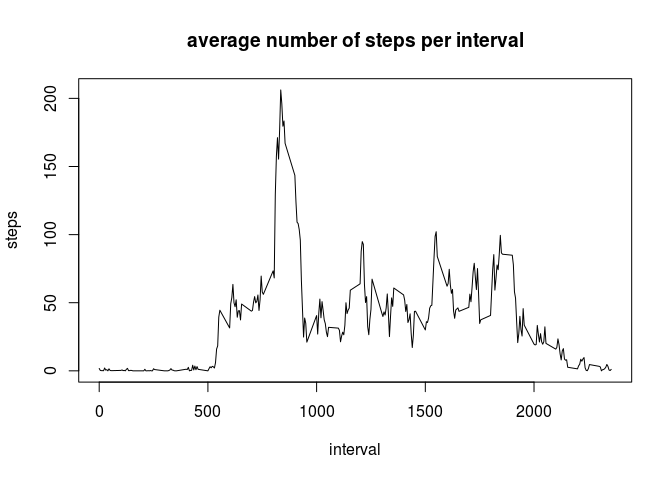
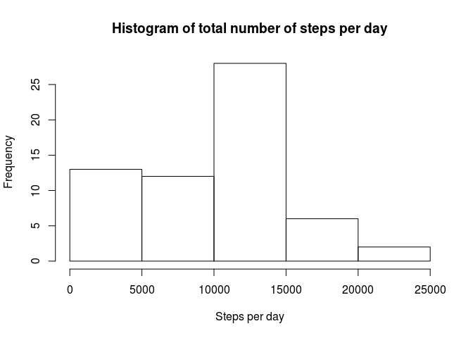
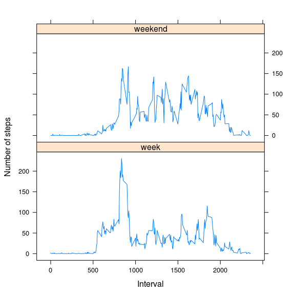

# Reproducible Research: Peer Assessment 1


## Loading and preprocessing the data

```r
# load the activity-data
activity <- read.csv("activity.csv")

# create new column date in data-format
activity$date2 <- as.Date(activity$date, format = "%Y-%m-%d")
```

## What is mean total number of steps taken per day?

```r
# create an aggregate data set of the sum of the steps per day
agg_day_activity <- setNames(aggregate(activity$steps, by=list(activity$date2), FUN=sum, na.rm=TRUE, na.action=NULL),c("date","steps"))

# create a histogram of the total number of steps per day
hist(agg_day_activity$steps, main = "Histogram of total number of steps per day", xlab = "Steps per day")
```

<!-- -->

```r
# calculate mean total number of steps per day
round(mean(agg_day_activity$steps))
```

```
## [1] 9354
```

```r
# calculate median total number of steps per day
round(median(agg_day_activity$steps))
```

```
## [1] 10395
```


## What is the average daily activity pattern?

```r
# create dataset with mean number of steps per interval
mean_steps_per_interval <- aggregate(list(steps = activity$steps), list(interval=activity$interval), mean,na.rm=TRUE, na.action=NULL)

# create the time-series plot
plot(mean_steps_per_interval,type='l', main="average number of steps per interval")
```

<!-- -->

```r
# what is the interval index with the highest average number of steps
mean_steps_per_interval[which(mean_steps_per_interval$steps == max(mean_steps_per_interval$steps)),]
```

```
##     interval    steps
## 104      835 206.1698
```


## Imputing missing values

```r
# calculate the total number of missing values ('NA')
sum(is.na(activity$steps))
```

```
## [1] 2304
```

```r
# replace all missing values with median for that interval
for(i in 1:nrow(activity)) {
        if(is.na(activity$steps[i])) {
                mean_value <- mean_steps_per_interval$steps[which(mean_steps_per_interval$interval==activity$interval[i])]
                activity$steps[i] <- mean_value
        }
}

# create a new aggregate dataset of the sum of the steps per day
agg_day_activity_imputed <- setNames(aggregate(activity$steps, by=list(activity$date2), FUN=sum, na.rm=TRUE, na.action=NULL),c("date","steps"))

# create a new histogram of the total number of steps per day
hist(agg_day_activity$steps, main = "Histogram of total number of steps per day", xlab = "Steps per day")
```

<!-- -->


## Are there differences in activity patterns between weekdays and weekends?


```r
# create a weekday vector
weekdays <- c('Monday', 'Tuesday', 'Wednesday', 'Thursday', 'Friday')

# create extra factor variable weekday/weekend
activity$weekday <- factor(weekdays(activity$date2))
activity$week_weekend <- factor(ifelse(activity$weekday %in% c("zaterdag","zondag"),"weekend","week"))

# create aggregate: steps per interval and week/weekend
averages_week_weekend <- aggregate(steps ~ interval + week_weekend, data = activity, mean)

library(lattice)
xyplot(averages_week_weekend$steps ~ averages_week_weekend$interval | factor(averages_week_weekend$week_weekend), type = "l", layout = c(1, 2), xlab = "Interval", ylab = "Number of steps")
```

<!-- -->

# thank you!
